## Abstract

  
  

## Find Me

欢迎扫码关注，我会做些有意思的事情。

<table width="100%">
  <tr>
    <th width="33%" align="center">微信公众号 · JustSong</th>
    <th width="33%" align="center">小红书 · JustSong</th>
    <th width="34%" align="center">B 站 · JustSongArrived</th>
  </tr>
  <tr>
    <td align="center" valign="middle">
      
    </td>
    <td align="center" valign="middle">
      
    </td>
    <td align="center" valign="middle">
      
    </td>
  </tr>
  <tr>
    <td align="center">使用微信扫码关注</td>
    <td align="center">小红书号：<a href="https://www.xiaohongshu.com/user/profile/61f122c30000000010007b28"><code>6533026394</code></a></td>
    <td align="center"><a href="https://space.bilibili.com/246177138">点击或扫码访问 B 站主页</a></td>
  </tr>
</table>

## Top Projects
|Project|Description|Stars|
|:--|:--|:--|
|[one-api](https://github.com/songquanpeng/one-api)|LLM API 管理 & 分发系统，支持 OpenAI、Azure、Anthropic Claude、Google Gemini、DeepSeek、字节豆包、ChatGLM、文心一言、讯飞星火、通义千问、360 智脑、腾讯混元等主流模型，统一 API 适配，可用于 key 管理与二次分发。单可执行文件，提供 Docker 镜像，一键部署，开箱即用。LLM API management & key redistribution system, unifying multiple providers under a single API. Single binary, Docker-ready, with an English UI.|`36649⭐`|
|[message-pusher](https://github.com/songquanpeng/message-pusher)|搭建专属于你的消息推送服务，支持多种消息推送方式，支持 Markdown，基于 Golang 仅单可执行文件，开箱即用|`3878⭐`|
|[go-file](https://github.com/songquanpeng/go-file)|基于 Go 的文件分享工具，仅单可执行文件，开箱即用，内置图床和视频播放页面. File sharing tool based on Go.|`1121⭐`|
|[wechat-server](https://github.com/songquanpeng/wechat-server)|微信公众号的后端，为其他系统提供微信登录验证功能|`530⭐`|
|[pytorch-template](https://github.com/songquanpeng/pytorch-template)|To be the world's best PyTorch project template.|`509⭐`|
|[gin-template](https://github.com/songquanpeng/gin-template)|用于 Gin & React 项目的模板. Template for Gin & React projects.|`399⭐`|
|[stats-cards](https://github.com/songquanpeng/stats-cards)|在 README 中展示你在知乎，GitHub，B 站，LeetCode，掘金，CSDN，牛客等网站的数据，也可用于服务状态监控. Show your LeetCode & GitHub stats in GitHub Profile.|`335⭐`|
|[pronunciation-corrector](https://github.com/songquanpeng/pronunciation-corrector)|拯救你的英语发音，告别因发音错误带来的尴尬！|`258⭐`|
|[blog](https://github.com/songquanpeng/blog)|个人博客系统|`72⭐`|
|[pytorch-deployment](https://github.com/songquanpeng/pytorch-deployment)|A template for rapid deployment of PyTorch models.|`65⭐`|

## Recent Updates
|Project|Description|Last Update|
|:--|:--|:--|
|[songquanpeng](https://github.com/songquanpeng/songquanpeng)|Automatically update your GitHub profile with GitHub Actions.||
|[blog](https://github.com/songquanpeng/blog)|个人博客系统||
|[one-proxy](https://github.com/songquanpeng/one-proxy)|轻松管理你的众多订阅，提供一个固定的订阅地址。||
|[go-text](https://github.com/songquanpeng/go-text)|基于 Go 的终端风格在线聊天工具，仅单可执行文件，开箱即用. Go based terminal-style chat room.||
|[textboard](https://github.com/songquanpeng/textboard)|None||
|[flomo-cli](https://github.com/songquanpeng/flomo-cli)|Unofficial cli for flomo||
|[one-api](https://github.com/songquanpeng/one-api)|LLM API 管理 & 分发系统，支持 OpenAI、Azure、Anthropic Claude、Google Gemini、DeepSeek、字节豆包、ChatGLM、文心一言、讯飞星火、通义千问、360 智脑、腾讯混元等主流模型，统一 API 适配，可用于 key 管理与二次分发。单可执行文件，提供 Docker 镜像，一键部署，开箱即用。LLM API management & key redistribution system, unifying multiple providers under a single API. Single binary, Docker-ready, with an English UI.||
|[message-pusher](https://github.com/songquanpeng/message-pusher)|搭建专属于你的消息推送服务，支持多种消息推送方式，支持 Markdown，基于 Golang 仅单可执行文件，开箱即用||
|[go-file](https://github.com/songquanpeng/go-file)|基于 Go 的文件分享工具，仅单可执行文件，开箱即用，内置图床和视频播放页面. File sharing tool based on Go.||
|[stats-cards](https://github.com/songquanpeng/stats-cards)|在 README 中展示你在知乎，GitHub，B 站，LeetCode，掘金，CSDN，牛客等网站的数据，也可用于服务状态监控. Show your LeetCode & GitHub stats in GitHub Profile.||

*Last updated on: 2026-08-31 00:17:10*
